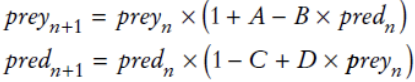

Task06: In a predator-prey simulation, you compute the populations of predators and prey, using the following equations:

Here, A is the rate at which prey birth exceeds natural death, B is the rate of predation, C is the rate at which predator deaths
exceed births without food, and D represents predator increase in the presence of food.
Write a program that prompts users for these rates, the initial population sizes, and the number of periods.
Then print the populations for the given number of periods. As inputs, try A = 0.1, B = C = 0.01, and D = 0.00002 with initial prey
and predator populations of 1,000 and 20.

